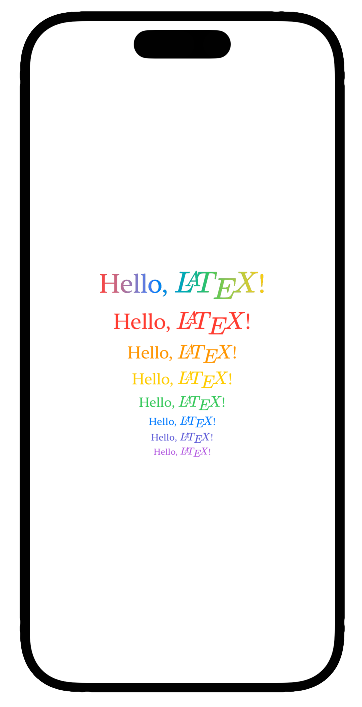

# LaTeXSwiftUI

A SwiftUI view that renders LaTeX.

 



## Installation

Add the dependency to your package manifest file.

```swift
.package(url: "https://github.com/colinc86/LaTeXSwiftUI", branch: "main")
```

## Usage

Import the package and use the view.

```swift
import LaTeXSwiftUI

struct MyView: View {

  var body: some View {
    LaTeX("Hello, $\\LaTeX$!")
  }

}
```


### Modifiers

The `LaTeX` view's body is built up of `Text` views so feel free to use any of the supported modifiers.

```swift
LaTeX("Hello, $\\LaTeX$!")
  .fontDesign(.serif)
  .foregroundColor(.blue)
```


Along with supporting the built-in SwiftUI modifies, `LaTeXSwiftUI` defines more to let you configure the view.

#### Parsing Mode

Text input can either be completely rendered, or `LaTeXSwiftUI` can search for top-level equations. The default behavior is to only render equations. Use the `parsingMode` modifier to change the default behavior.

```swift
// Only parse the equation
LaTeX("Hello, $\\LaTeX$!")
  .parsingMode(.onlyEquations)

// Parse the entire input
LaTeX("e^{i\\pi}+1=0")
  .parsingMode(.all)
```


#### Image Rendering Mode

You can specify the rendering mode of the rendered equations so that they either take on the style of the surrounding text or display the style rendered by MathJax. The default behavior is to use the `template` rendering mode so that images match surrounding text.

```swift
// Render images to match the surrounding text
LaTeX("Hello, $\\color{red}\\LaTeX$!")
  .imageRenderingMode(.template)

// Display the original rendered image
LaTeX("Hello, ${\\color{red} \\LaTeX}$!")
  .imageRenderingMode(.original)
```


#### Error Mode

When an error occurs while parsing the input the view will display the original LaTeX. You can change this behavior by modifying the view's `errorMode`.

```swift
// Display the original text instead of the equation
LaTeX("$\\asdf$")
  .errorMode(.original)

// Display the error text instead of the equation
LaTeX("$\\asdf$")
  .errorMode(.error)

// Display the rendered image (if available)
LaTeX("$\\asdf$")
  .errorMode(.rendered)
```


#### Unencode HTML

Input may contain HTML entities such as `&lt;` which will not be parsed by LaTeX as anything meaningful. In this case, you may use the `unencoded` modifier.

```swift
LaTeX("$x^2&lt;1$")
  .errorMode(.error)

// Replace "lt;" with "<"
LaTeX("$x^2&lt;1$")
  .unencoded()
```


#### TeX Options

For more control over the MathJax rendering, you can pass a `TeXInputProcessorOptions` object to the view.

```swift
// Add AMS style equation numbering
LaTeX("""
\\begin{equation}
  e^{i\\pi}+1=0
\\end{equation}
""").texOptions(TexInputProcessorOptions(loadPackages: TexInputProcessorOptions.Packages.all))
```
